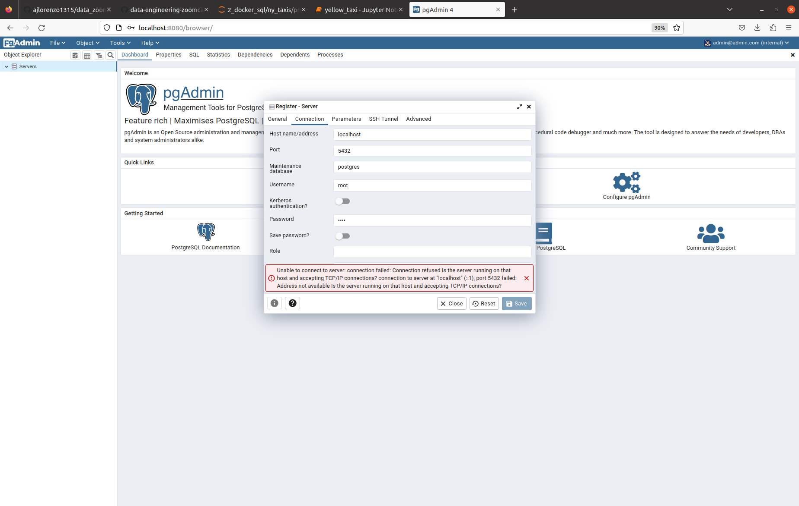
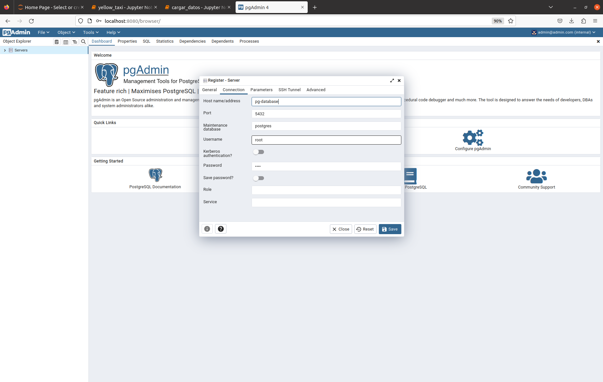

Ahora copiamos y pegamso el siguiente comando en terminal

<pre>

docker run -it \
    -e POSTGRES_USER=root \
    -e POSTGRES_PASSWORD=root \
    -e POSTGRES_DB="ny_taxi" \
    -v $(pwd -P)/ny_taxi_progres_data:/var/lib/protgresql/data \
    -p 5432:5432 \
    postgres:13

</pre>

Luego ejecutamos el notebook de [yellow_taxi.ipynb](yellow_taxi.ipynb)

y luego en una terminal ejecutamos

PGadmin

<pre>
docker run -it \
  -e PGADMIN_DEFAULT_EMAIL="admin@admin.com" \
  -e PGADMIN_DEFAULT_PASSWORD="root" \
  -p 8080:80 \
  dpage/pgadmin4
</pre>

en el buscador escribimos 
<pre>
http://localhost:8080/
</pre>

problema no lo estamos realizando en el contare por lo que tenemos que conectar los dos containers  entonces hay que pararlo 
y tenemos que crar una network creade

<pre>
alourido@GRAD0356UBUNTU:~/Escritorio/data-engineering-zoomcamp/data_zoomcamp/2_docker_sql/ny_taxis/prueba_3_pg_admin$ sudo docker network create pg-network
964721a06bd4ce9ca069b9f5a0417e7683f6ae7125805c6be1e6815d14c1c6ec

docker run -it \
    -e POSTGRES_USER=root \
    -e POSTGRES_PASSWORD=root \
    -e POSTGRES_DB="ny_taxi" \
    -v /home/alourido/Escritorio/data-engineering-zoomcamp/data_zoomcamp/2_docker_sql/ny_taxis/prueba_1/ny_taxi_progres_data:/var/lib/protgresql/data \
    -p 5432:5432 \
    --network=pg-network\
    --name pg-database\
    postgres:13

docker run -it \
  -e PGADMIN_DEFAULT_EMAIL="admin@admin.com" \
  -e PGADMIN_DEFAULT_PASSWORD="root" \
  -p 8080:80 \
  --network=pg-network\
  --name pgadmin\
  dpage/pgadmin4

</pre>

si no hay datos ejecutamas el cargar_datos.ipynb

